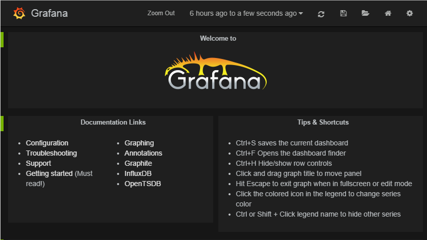
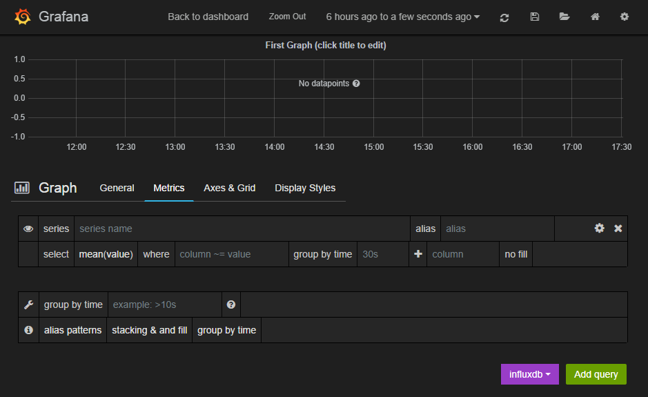
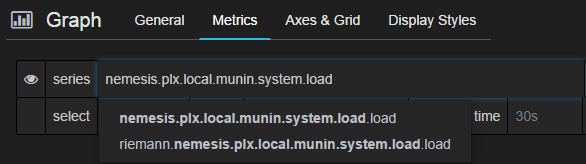
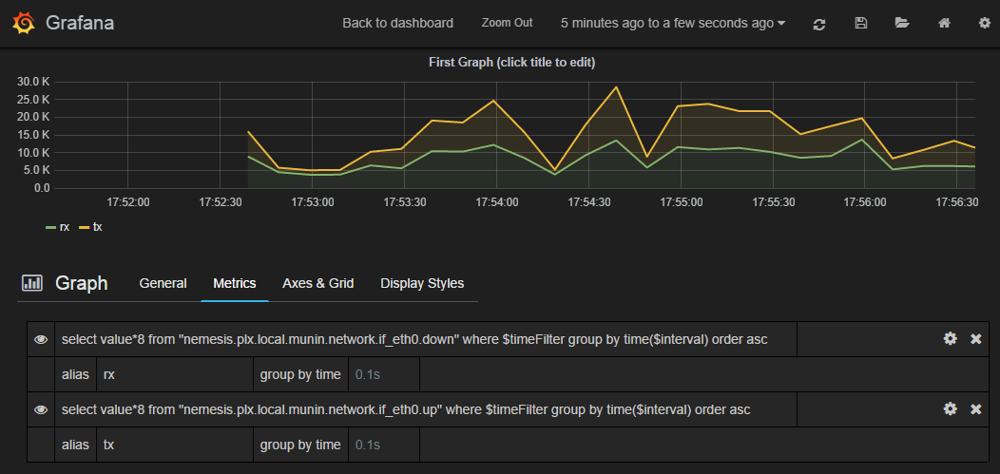
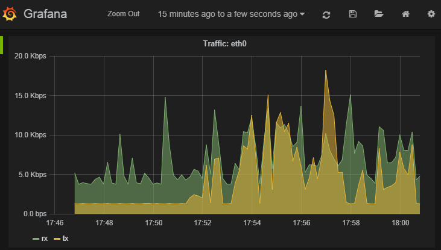

Example configurations
**********************

Replacing Munin
===============

The first step is to create a TRIG stack (Tensor Riemann InfluxDB Grafana).

Step 1: Install Riemann
-----------------------
::

    $ wget http://aphyr.com/riemann/riemann_0.2.6_all.deb
    $ aptitude install openjdk-7-jre
    $ dpkg -i riemann_0.2.6_all.deb

Step 2: Install InfluxDB
------------------------
::

    $ wget http://s3.amazonaws.com/influxdb/influxdb_latest_amd64.deb
    $ sudo dpkg -i influxdb_latest_amd64.deb

Start InfluxDB, then quickly change the root/root default password
because it also defaults to listening on all interfaces and apparently
this is not important enough for them to fix.

Create a `riemann` and `grafana` database, and some users for them

::

    $ curl -X POST 'http://localhost:8086/db?u=root&p=root' \
      -d '{"name": "riemann"}'
    $ curl -X POST 'http://localhost:8086/db?u=root&p=root' \
      -d '{"name": "grafana"}'
    $ curl -X POST 'http://localhost:8086/db/riemann/users?u=root&p=root' \
      -d '{"name": "riemann", "password": "riemann"}'
    $ curl -X POST 'http://localhost:8086/db/grafana/users?u=root&p=root' \
      -d '{"name": "grafana", "password": "grafana"}'

NB. InfluxDB is easy to get running but is not production ready or stable
so your data can very easily be lost.

Step 3: Install Grafana
-----------------------
::

    $ aptitude install nginx
    $ mkdir /var/www
    $ cd /var/www
    $ wget http://grafanarel.s3.amazonaws.com/grafana-1.8.1.tar.gz
    $ tar -zxf grafana-1.8.1.tar.gz
    $ mv grafana-1.8.1 grafana

Now we must create an nginx configuration in `/etc/nginx/sites-enabled`.

You can use something like this
::

    server {
        listen 80;
        server_name <your hostname>;
        access_log /var/log/nginx/grafana-access.log;
        error_log /var/log/nginx/grafana-error.log;

        location / {
            alias /var/www/grafana/;
            index index.html;
            try_files $uri $uri/ /index.html;
        }
    }

Next we need a configuration file for grafana. Open `/var/www/grafana/config.js`
and use the following configuration ::

    define(['settings'],
    function (Settings) {
      return new Settings({
        datasources: {
          influxdb: {
            type: 'influxdb',
            url: "http://<your hostname>:8086/db/riemann",
            username: 'riemann',
            password: 'riemann',
          },
          grafana: {
            type: 'influxdb',
            url: "http://<your hostname>:8086/db/grafana",
            username: 'grafana',
            password: 'grafana',
            grafanaDB: true
          },
        },
        search: {
          max_results: 20
        },
        default_route: '/dashboard/file/default.json',
        unsaved_changes_warning: true,
        playlist_timespan: "1m",
        admin: {
          password: ''
        },
        window_title_prefix: 'Grafana - ',
        plugins: {
          panels: [],
          dependencies: [],
        }
      });
    });
     
Step 4: Glue things together
----------------------------

Lets start by configuring Riemann to talk to InfluxDB. This is the 
full /etc/riemann/riemann.config file. ::
    
    ; -*- mode: clojure; -*-
    ; vim: filetype=clojure
    (require 'capacitor.core)
    (require 'capacitor.async)
    (require 'clojure.core.async)

    (defn make-async-influxdb-client [opts]
        (let [client (capacitor.core/make-client opts)
              events-in (capacitor.async/make-chan)
              resp-out (capacitor.async/make-chan)]
            (capacitor.async/run! events-in resp-out client 100 10000)
            (fn [series payload]
                (let [p (merge payload {
                        :series series
                        :time   (* 1000 (:time payload)) ;; s → ms
                    })]
                    (clojure.core.async/put! events-in p)))))

    (def influx (make-async-influxdb-client {
            :host     "localhost"
            :port     8086
            :username "riemann"
            :password "riemann"
            :db       "riemann"
        }))

    (logging/init {:file "/var/log/riemann/riemann.log"})

    ; Listen on the local interface over TCP (5555), UDP (5555), and websockets
    ; (5556)
    (let [host "0.0.0.0"]
      (tcp-server {:host host})
      (udp-server {:host host})
      (ws-server  {:host host}))

    (periodically-expire 60)

    (let [index (index)]
      (streams
            index

            (fn [event]
                (let [series (format "%s.%s" (:host event) (:service event))]
                    (influx series {
                        :time  (:time event)
                        :value (:metric event)
                    })))))

You're pretty much done at this point, and should see the metrics from the
Riemann server process if you open up Grafana and look through the query
builder.

Step 5: Using Tensor to retrieve stats from munin-node
------------------------------------------------------

First of all, install Tensor ::
    
    $ pip install tensor

Next create /etc/tensor and a `tensor.yml` file in that directory.

The `tensor.yml` config file should look like this ::
    
    ttl: 60.0
    interval: 1.0

    outputs:
        - output: tensor.outputs.riemann.RiemannTCP
          port: 5555
          server: <riemann server>

    # Sources
    sources:
        - service: mymunin
          source: tensor.sources.munin.MuninNode
          interval: 60.0
          ttl: 120.0
          critical: {
            mymunin.system.load.load: "> 2"
          }

This configures Tensor to connect to the munin-node on the local machine and
retrieve all configured plugin values. You can create critical alert levels
by setting the dot separated prefix for the service name and munin plugin.

You can now start Tensor ::

    $ twistd -n tensor -c /etc/tensor/tensor.yml
    2014-10-22 13:30:38+0200 [-] Log opened.
    2014-10-22 13:30:38+0200 [-] twistd 14.0.2 (/home/colin/riemann-tensor/ve/bin/python 2.7.6) starting up.
    2014-10-22 13:30:38+0200 [-] reactor class: twisted.internet.epollreactor.EPollReactor.
    2014-10-22 13:30:38+0200 [-] Starting factory <tensor.protocol.riemann.RiemannClientFactory instance at 0x7faeec021b90>

This pretty much indiciates everything is alright, or else we'd see quickly
see some errors.

Next we will add some graphs to Grafana

Step 6: Creating graphs in Grafana
----------------------------------

Click on the green row tag on the left, and delete all but the last row.
This will leave you with an empty graph.

Click the title of the graph, then click `Edit`.

In the edit screen the Metrics tab will be open already. Now we can add our
munin metrics. If you start typing in the `series` field you should see your
hosts and metrics autocomplete.

Many Munin metrics are `counter` types which are usually converted to a rate
by the RRD aggregation on Munin Graph.

Handily the :class:`tensor.sources.munin.MuninNode` source takes care of this
by caching the metric between run intervals when that type is used. 

If we wanted to graph our network interface all we need to do is make it a
slightly better unit by multiplying the Byte/sec metric by 8, since Grafana
provides a bit/sec legend format.

To do this start by clicking the gear icon on the metric query, then select
`Raw query mode`. 

Use the following query ::
    
    select value * 8 from "<your hostname>.munin.network.if_eth0.down" where $timeFilter group by time($interval) order asc

And chose an alias of "RX". Do the same for if_eth0.up and alias that "TX".
You should end up with something like this

Click on `General` to edit the title, and then on `Axes & Grid` change the
Format to `bps`. Under `Display Styles` you can stack the data or play around
with the look of the graph. Click `Back to dashboard` and you should end up
with something as follows

